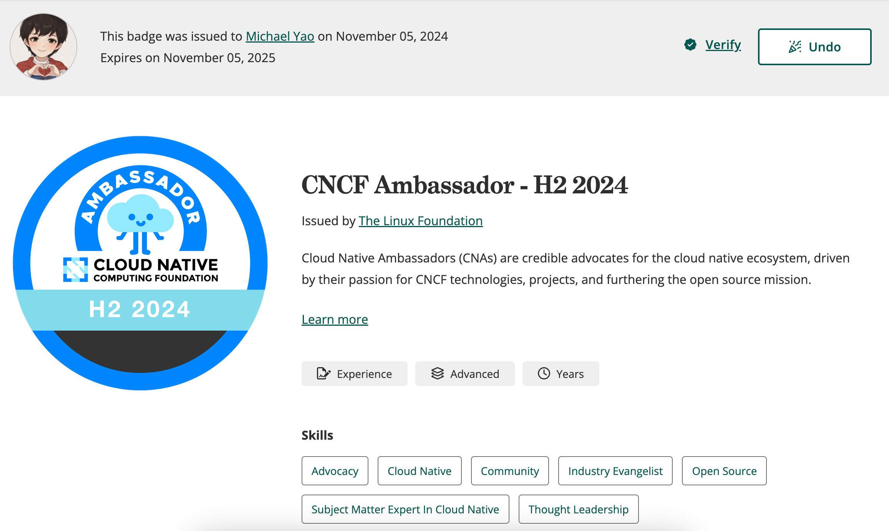

---
hide:
  - toc
  - navigation
---

# 关于 Michael Yao

[Michael Yao](https://github.com/windsonsea) 是一名在 GitHub CNCF 社区活跃的贡献者，
他目前是 CNCF Ambassador，也是以下几个网站的 Maintainer:

- 通过 Hugo 编译的网站：

    - [k8s.io](http://k8s.io)：全球 AI 负载容器化编排的事实标准技术，CNCF 毕业项目，国内代码贡献 DaoCloud 排名第一，Michael 是维护者之一
    - [istio.io](http://istio.io)：全球最流行的现代化服务网格技术，CNCF 毕业项目，国内代码贡献 DaoCloud 排名前三，Michael 是维护者之一
    - [opentelemetry.io](https://opentelemetry.io/)：全球最流行的可观测项目，CNCF 毕业项目，DaoCloud 有三名维护者参与其中，Michael 是维护者之一
    - [klts.io](http://klts.io)：经 DaoCloud 开源的早期项目，向公众提供免费长期的 Kubernetes 旧版本支持，修复各种 CVE，Michael 是维护者之一
    - [clusterpedia.io](http://clusterpedia.io)：经 DaoCloud 开源并捐献给 CNCF 后成功加入 Sandbox，Michael 是维护者之一
    - [merbridge.io](http://merbridge.io)：经 DaoCloud 开源并捐献给 CNCF 后成功加入 Sandbox，Michael 是维护者之一
    - [KWOK](https://kwok.sigs.k8s.io/)：经 DaoCloud 开源并捐献给 Kubernetes 社区成为一个 SIG 项目，
    被 Apple、IBM、OpenAI 等广泛使用的测试模拟工具，Michael 是一名 Reviewer

- 通过 MkDocs 编译的网站：

    - [docs.daocloud.io](http://docs.daocloud.io)：经 DaoCloud 开源的第五代云原生操作系统的全球文档站，Michael 是 Owner
    - [docs.d.run](https://docs.d.run/)：经 DaoCloud 开源的算力操作系统的全球文档站，Michael 是 Owner
    - [kubean.io](https://kubean-io.github.io/kubean/en/)：经 DaoCloud 开源并捐献给 CNCF 后成功加入 Sandbox，Michael 是维护者之一
    - [spiderpool.io](https://spidernet-io.github.io/spiderpool/)：经 DaoCloud 开源并捐献给 CNCF 后成功加入 Sandbox，Michael 是维护者之一

- 通过 Docusaurus 编译的网站：

    - [hwameistor.io](http://hwameistor.io)：经 DaoCloud 开源并捐献给 CNCF 后成功加入 Sandbox，Michael 是维护者之一
    - [karmada.io](http://karmada.io)：经华为开源，DaoCloud 代码贡献量排名第一，Michael 是维护者之一

